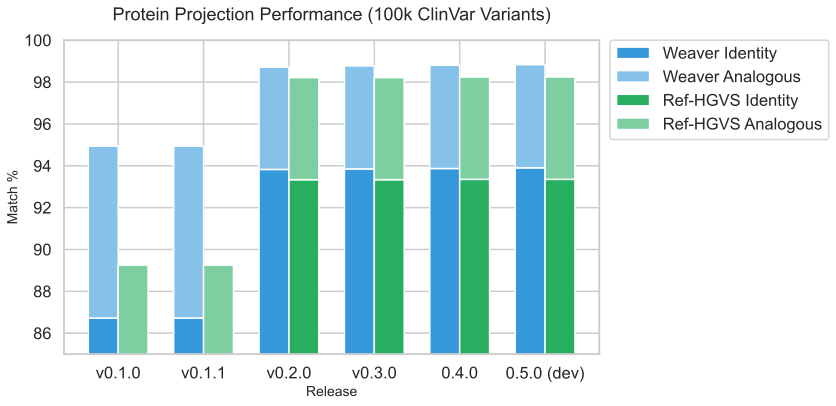

# weaver


High-performance HGVS variant mapping and validation engine.

Registered on PyPI as `hgvs-weaver`.
Registered on Crates.io as `hgvs-weaver`.

## Overview

`weaver` parses HGVS descriptions, projects them between coordinate systems, predicts protein
consequences, normalises them, renders them as SPDI and GA4GH VRS, and decides whether two
descriptions name the same change. The core is Rust; the Python package wraps it with typed
exceptions and protocol-based data access, so it needs no database.

### What it does

- **Parsing and formatting** of `g.`, `m.`, `c.`, `n.`, `r.` and `p.` descriptions: substitutions,
  deletions, insertions, duplications, delins, inversions, repeats (`[n]`) and identity; intronic
  offsets and CDS anchors (`c.-12`, `c.*5`, `c.88+2`); uncertain genomic breakpoints
  (`g.(?_100)_(200_?)del`); and the statements `p.?`, `p.0`, `p.Met1?`, `r.0`, `r.spl`, `r.=`.
  The grammar is checked rule by rule against the biocommons `hgvs` grammar table.
- **Projection** between systems through transcript models: `g.` to and from `c.`/`n.`, intronic
  positions included; `r.` to and from `c.`/`n.` (the same positions in RNA letters, with a
  change across a splice junction refused a genomic form); `c.` and `r.` to `p.`; `p.` back to
  `c.` for substitutions.
- **Protein consequences read from codons**, not from a protein-string diff: silent, missense,
  nonsense, in-frame changes written 3'-most, frameshifts with the distance to the new stop, stop
  losses as extensions, a stop formed inside inserted bases, selenocysteine `TGA` not read as a
  stop, the declared CDS end as the reference stop; an edit across the start codon gives
  `p.Met1?`, a deleted CDS `p.0?`.
- **Normalisation** by the 3' rule, cyclic over repeats, with insertions that repeat their
  neighbours written as duplications; `del` and `dup` are written bare; intronic edits are left as
  written. **Validation** checks stated bases and residues against the sequence.
- **Canonical alleles, SPDI and GA4GH VRS 2.0.** A canonical allele is a change on a sequence,
  fully justified over its region of ambiguity, so every spelling of one change is one allele
  with one computed identifier (`ga4gh:VA.…`). `to_spdi_unambiguous`, `to_vrs` and `vrs_id`
  render it for nucleotide variants (on the genome) and protein variants (on the protein);
  `protein_vrs` gives the protein allele of a coding variant, frameshifts and extensions
  included; deletions with uncertain breakpoints carry VRS `Range` bounds. `from_vrs` and
  `from_spdi` read alleles back into normalised HGVS. Refget accessions come from a `Refget`
  lookup (a refget server, or any table) or are computed from the sequence.
- **Equivalence** at four levels, `Identity`, `Analogous`, `Different`, `Unknown`, judged by
  canonical alleles for nucleotide variants and by the protein each description leaves for
  protein ones, so `p.Tyr165Ter`, `p.Ala164_Tyr165insTer` and the `c.` deletion that causes them
  agree. [How it decides](docs/source/equivalence_logic.md).

### Correctness through types

Positions are tagged integers: `GenomicPos`, `TranscriptPos` and `ProteinPos` are 0-based indices,
`HgvsGenomicPos`, `HgvsTranscriptPos` and `HgvsProteinPos` are the 1-based coordinates HGVS writes
(with `c.` skipping the non-existent position 0). Transcript positions carry an anchor
(transcript start, CDS start, CDS end) and an optional intronic offset, and resolve through one
`TranscriptMapper`. Mixing systems is a compile error in Rust, not an off-by-one at run time.

#### Examples

```python
import weaver

v = weaver.parse("NM_000051.3:c.123A>G")
print(v.format())  # NM_000051.3:c.123A>G

mapper = weaver.VariantMapper(provider)  # see Data Provider below; keep one, it caches

print(mapper.c_to_p(v))                                   # NP_000042.3:p.(Lys41Arg)
print(mapper.c_to_g(v))                                   # NC_000011.10:g.108227625A>G
print(mapper.normalize_variant(weaver.parse("NM_000051.3:c.4_5del")))  # NM_000051.3:c.5_6del

print(mapper.to_spdi_unambiguous(v))                      # NC_000011.10:108227624:A:G
allele = mapper.to_vrs(v)                                 # dict in the VRS 2.0 Allele schema
print(allele["id"])                                       # ga4gh:VA.…
print(mapper.from_vrs(allele))                            # NC_000011.10:g.108227625A>G

r = mapper.c_to_r(v)                                      # NM_000051.3:r.123a>g
print(mapper.c_to_p(r))                                   # the same protein prediction

level = mapper.equivalent_level(v, weaver.parse("NP_000042.3:p.Lys41Arg"), searcher)
print(level)                                              # EquivalenceLevel.Analogous
```

## Data Provider Implementation

Mapping needs an object implementing the `DataProvider` protocol, which supplies transcript models
and reference sequences. `weaver.cli.provider.RefSeqDataProvider` implements it over a RefSeq GFF3
and FASTA; `weaver.refget.RefgetProvider` implements it over a GA4GH refget server (for sequences)
plus another provider for transcript models.

A `VariantMapper` caches the sequence blocks and refget accessions it fetches for as long as it
lives. Build one and reuse it.

### Coordinate Expectations

When implementing a `DataProvider`, you must provide coordinates in the following formats:

- **Transcript Models**:
    - `cds_start_index`: The 0-based inclusive index of the first base of the start codon (A of ATG) relative to the transcript start.
    - `cds_end_index`: The 0-based inclusive index of the last base of the stop codon relative to the transcript start.
    - **Exons**:
        - `transcript_start`: 0-based inclusive start index in the transcript.
        - `transcript_end`: 0-based **exclusive** end index in the transcript.
        - `reference_start`: 0-based inclusive start index on the genomic reference.
        - `reference_end`: 0-based inclusive end index on the genomic reference.

- **Sequence Retrieval**:
    - `get_seq(ac, start, end, kind)`: Should return the sequence for accession `ac`. `start` and `end` are 0-based half-open (interbase) coordinates. `end` is `None` when the whole sequence from `start` is wanted (`seq[start:end]` handles this). A range past the end of the sequence returns the bases that exist.

### Python Protocol

```python
class DataProvider(Protocol):
    def get_transcript(self, transcript_ac: str, reference_ac: str | None) -> TranscriptData:
        """Return a dictionary matching the TranscriptData structure."""
        ...

    def get_seq(self, ac: str, start: int, end: int | None, kind: str | IdentifierType) -> str:
        """Fetch sequence for an accession; end=None means to the end. kind is an IdentifierType."""
        ...

    def get_symbol_accessions(self, symbol: str, source_kind: str, target_kind: str) -> list[tuple[str, str]] | list[tuple[IdentifierType, str]]:
        """Map gene symbols to accessions (e.g., 'ATM' -> [('transcript_accession', 'NM_000051.3')])."""
        ...

    def get_identifier_type(self, identifier: str) -> str | IdentifierType:
        """Identify what type of identifier a string is (e.g., 'genomic_accession', 'gene_symbol')."""
        ...
```

### Refget

VRS identifies a sequence by its refget accession (`SQ.` + the sha512t24u digest of its bases).
Pass a `Refget` lookup to the mapper, `VariantMapper(provider, refget=lookup)`, and `to_vrs` asks
it for accessions and `from_vrs` can name the sequence behind one. Without it, accessions are
computed by hashing the whole sequence (slow for a chromosome, cached per mapper) and `from_vrs`
needs the accession passed. A `RefgetProvider` is a `Refget` as well as a `DataProvider`.

```python
class Refget(Protocol):
    def get_refget_accession(self, ac: str) -> str | None: ...
    def get_accession_for_refget(self, refget: str) -> str | None: ...
```

## Dataset

This repository includes a dataset of 100,000 variants sampled from ClinVar (August 2025 release) for validation purposes, located in `data/clinvar_variants_100k.tsv`.

**ClinVar License & Terms**:
ClinVar data is public domain and available for use under the terms of the [National Library of Medicine (NLM)](https://www.ncbi.nlm.nih.gov/home/about/policies/). Use of ClinVar data must adhere to their [citation and data use policies](https://www.ncbi.nlm.nih.gov/clinvar/docs/maintenance_use/).

## Installation

```sh
pip install hgvs-weaver
```

## Usage

```python
import weaver

# Parse a variant
var = weaver.parse("NM_000051.3:c.123A>G")
print(var.ac)  # NM_000051.3
print(var.format())  # NM_000051.3:c.123A>G
```

## Validation

`weaver` has been extensively validated against ClinVar data to ensure accuracy and parity with the standard Python HGVS implementation.

### Running Validation

To rerun the validation, you need the RefSeq annotation and genomic sequence files:

1. **Download Required Files**:

   ```sh
   # Download RefSeq GFF
   curl -O https://ftp.ncbi.nlm.nih.gov/refseq/H_sapiens/annotation/GRCh38_latest/refseq_identifiers/GRCh38_latest_genomic.gff.gz

   # Download RefSeq FASTA and decompress
   curl -O https://ftp.ncbi.nlm.nih.gov/refseq/H_sapiens/annotation/GRCh38_latest/refseq_identifiers/GRCh38_latest_genomic.fna.gz
   gunzip GRCh38_latest_genomic.fna.gz
   ```

2. **Install Validation Dependencies**:

   ```sh
   pip install pysam tqdm bioutils parsley
   pip install hgvs --no-deps  # Avoids psycopg2 build requirement
   ```

3. **Run Validation**:
   You can run the validation using the installed entry point (if you installed with `[validation]` extra):

   ```sh
   weaver-validate data/clinvar_variants_100k.tsv \
       --output-file results.tsv \
       --gff GRCh38_latest_genomic.gff.gz \
       --fasta GRCh38_latest_genomic.fna
   ```

   Alternatively, if you use `uv`, you can run the script directly from the source tree without manually installing dependencies (it will use the PEP 723 metadata to auto-install them):

   ```sh
   uv run weaver/cli/validate.py data/clinvar_variants_100k.tsv ...
   ```

### Parsing Quality

Parsing is checked three ways, all in the test suite:

- **The biocommons `hgvs` grammar table**: 580 inputs over the 92 grammar rules the two grammars
  share, each required to be accepted or rejected as the table says. One difference is recorded
  on purpose: weaver accepts a terminator inside an amino acid sequence (`insTerGlu`), which
  ClinVar writes.
- **Real-world strings**: a gauntlet of 31 descriptions collected from the wild, the HGVS
  specification's examples, and every description in the 100,000-variant ClinVar set, of which
  weaver parses all (the reference implementation rejects 394).
- **Properties**: a random canonical description round-trips through the parser and formatter,
  and arbitrary text never panics the parser. Fifteen such properties cover parsing, coordinates,
  normalisation, alleles and protein prediction.

The `r.` conversions were cross-checked against VariantValidator on fourteen queries: every exonic
case agreed on the `r.`, `c.`, `g.` and `p.` descriptions.

<!-- markdownlint-disable MD033 -->
<!-- PERFORMANCE_GRAPH_START -->
<p align="center">
  <picture>
    <source media="(prefers-color-scheme: dark)" srcset="benchmark_results/performance_dark.svg">
    <source media="(prefers-color-scheme: light)" srcset="benchmark_results/performance_light.svg">
    
  </picture>
</p>
<!-- PERFORMANCE_GRAPH_END -->
<!-- markdownlint-enable MD033 -->

### Validation Results (100,000 variants)

Summary of results comparing `weaver` and `ref-hgvs` against ClinVar ground truth:

| Implementation | Protein Identity | Protein Analogous | SPDI (Genomic) | Total Success | Parse Errors |
| :------------- | :--------------: | :---------------: | :------------: | :-----------: | :----------: |
| weaver         |  **93.902%**  | **4.928%** | **98.768%** | **98.830%** | **0** |
| ref-hgvs       |  93.352%  | 4.890% | 97.726% | **98.242%** | 394 |


Transcripts absent from the RefSeq annotation (LRG, superseded versions): 1,126 (1.1%)

#### Protein Translation Agreement

|                     | ref-hgvs Match | ref-hgvs Mismatch |
| :------------------ | :------------: | :---------------: |
| **weaver Match**    |     93,351     |     551     |
| **weaver Mismatch** |     1     |     6,097     |

#### SPDI Mapping Agreement

|                     | ref-hgvs Match | ref-hgvs Mismatch |
| :------------------ | :------------: | :---------------: |
| **weaver Match**    |     97,724     |     1,044     |
| **weaver Mismatch** |     2     |     1,230     |

## Type stubs

`weaver/_weaver.pyi` is generated by `stubloom` and committed, so consumers get types from the wheel without
running anything. Regenerate it after changing the Rust surface:

```bash
stubloom generate --module weaver._weaver --package hgvs-weaver-py --out weaver/_weaver.pyi \
    --allow-any Variant.from_dict.d \
    --allow-any "Variant.to_dict return" \
    --allow-any Variant.validate.provider \
    --allow-any VariantMapper.__new__.provider \
    --allow-any VariantMapper.__new__.refget \
    --allow-any VariantMapper.from_vrs.allele \
    --allow-any VariantMapper.equivalent.searcher \
    --allow-any VariantMapper.equivalent_level.searcher \
    --allow-any VariantMapper.g_to_c_all.searcher
```

Each `--allow-any` names a signature that takes or returns `Py<PyAny>`, which carries no type to translate. Giving
those parameters Rust newtypes named `DataProvider` and `TranscriptSearch` — the protocols they already satisfy in
`weaver/__init__.py` — would let the stub resolve them by itself and retire the flags.
