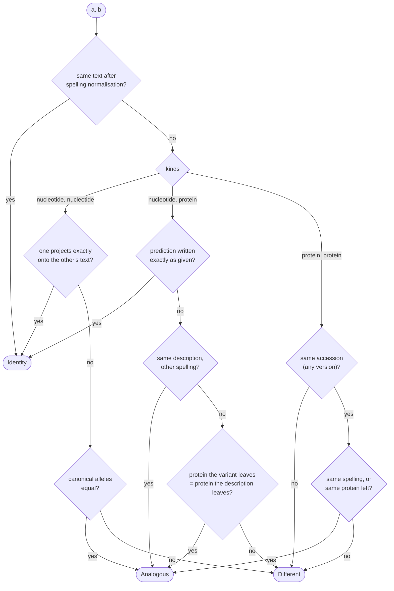

# How Equivalence Is Decided

`VariantMapper.equivalent_level(a, b, searcher)` says whether two HGVS descriptions name the same
change. It answers at one of four levels:

| Level         | Meaning                                                                                  |
| :------------ | :--------------------------------------------------------------------------------------- |
| `Identity`    | The same text after spelling normalisation, or a prediction written exactly as given.     |
| `Analogous`   | Different text, the same change: the same allele, or the same protein left behind.        |
| `Different`   | Both descriptions are understood and they name different changes.                        |
| `Unknown`     | A description could not be judged (an error from the data provider, a missing sequence). |

`equivalent(a, b, searcher)` is `Identity` or `Analogous`.

## Before comparing

- A gene symbol in place of an accession is expanded to every accession the provider maps it to,
  of the kind the coordinate system needs; the pair is equivalent if any expansion is.
- An `m.` variant is compared as the `g.` variant it is on the mitochondrial reference.
- An `r.` variant is compared as its `c.` or `n.` spelling (`r_to_c`, `r_to_n`); `r.0`, `r.spl` and
  the other statements about a transcript are compared as text.

## The rules

### Nucleotide against nucleotide

Two `g.`, `c.` or `n.` variants are the same change exactly when their **canonical alleles** are
equal. A canonical allele is the change projected onto the genomic reference, trimmed to what it
alters, then widened over the whole region in which it could equally be written (VRS/VOCA
"fully justified" normalisation). So `c.4_6del` and `c.10_12del` in a run of the same trinucleotide,
`g.10_11insA` and `g.10dup` after an `A`, and a `c.` variant against its own `g.` projection all have
one allele. Edits without an allele (conversions, copy numbers) are `Different` unless the text
matches.

### Nucleotide against protein

The nucleotide variant is taken to every coding transcript it lies on (a `c.` is its own; a `g.` or
`n.` is projected and the `searcher` names the transcripts). For each, the predicted `p.`
description is compared with the given one: written exactly as given it is `Identity`
(`c.1799T>A` against `p.(Val600Glu)`); the same description in another spelling is `Analogous`
(`p.Val600Glu`, `p.V600E`). Failing that, the **protein the variant leaves** (`predicted_protein`) is
compared with the **protein the description leaves** (below); if they can be the same protein the
pair is `Analogous`.

### Protein against protein

Two `p.` descriptions must be on the same protein accession, any version (ClinVar often names an
older `NP_` version). They are `Analogous` if they are the same description in another spelling, or
if the proteins they leave can be the same.

### The protein a description leaves

Every `p.` description that says something about the sequence is turned into the protein it
leaves, in one-letter code, read against the reference protein:

- a substitution, deletion, insertion, duplication, delins, repeat or identity is applied to the
  reference; a **stop** among the new residues ends the protein there (`p.Tyr165Ter`,
  `p.Ala164_Tyr165insTer` and `p.Tyr164_Tyr165delinsTer` all leave the protein ended after 164);
- a frameshift `p.Arg97ProfsTer4` leaves the reference up to 96, then `P`, then two residues it does
  not name (written `X`, which matches any residue), then ends;
- a frameshift or extension **without a length** (`p.Arg97fs`, `p.Ter599TrpextTer?`) and a stop
  loss written as a substitution (`p.Ter599Trp`, ClinVar's form) leave an **open** outcome: what is
  known, then more residues in unknown number. An open outcome matches any outcome it is a prefix
  of;
- `p.0` and `p.0?` leave no protein; `p.=` leaves the reference;
- `p.?` says nothing and matches nothing; `p.Met1?` and its like are **anchored**: they say only
  where the change starts, and match an outcome whose change starts at that residue.

Judging needs the protein sequence. With no sequence to read the description against the result is
an error (`Unknown` in the harness), not a guess from the residues the descriptions happen to name.

## Examples

| Level        | A                              | B                                    | Why                                                        |
| :----------- | :----------------------------- | :----------------------------------- | :--------------------------------------------------------- |
| `Identity`   | `c.123A>G`                     | `c.123A>G`                           | Same text.                                                 |
| `Identity`   | `NC_…:g.5000A>G`               | `NM_…:c.123A>G`                      | The `c.` projects to exactly that `g.`.                    |
| `Identity`   | `c.1799T>A`                    | `p.(Val600Glu)`                      | The prediction, written as predicted.                      |
| `Analogous`  | `c.1799T>A`                    | `p.Val600Glu`                        | The same description, observed rather than predicted.      |
| `Analogous`  | `c.4_6del`                     | `c.10_12del`                         | One allele: the same trinucleotide run, one unit shorter.  |
| `Analogous`  | `g.10_11insA`                  | `g.10dup`                            | One allele.                                                |
| `Analogous`  | `p.Tyr165Ter`                  | `p.Ala164_Tyr165insTer`              | Both leave the protein ended after 164.                    |
| `Analogous`  | `c.495_498del`                 | `p.Ala164_Tyr165insTer`              | The frameshift's first stop is at 165; same protein left.  |
| `Analogous`  | `c.567delG`                    | `p.Ala190Profs`                      | The frameshift starts Ala190Pro; the rest is unknown.      |
| `Analogous`  | `c.1796A>G`                    | `p.Ter599Trp`                        | A stop loss, written as ClinVar writes it.                 |
| `Analogous`  | `p.490PRS[1]`                  | `p.Pro493_Ser495del`                 | One copy of a three-residue unit removed, either way.      |
| `Different`  | `c.123A>G`                     | `c.123A>T`                           | Different alleles.                                         |
| `Different`  | `c.1799T>A`                    | `p.Val600Lys`                        | Different protein left.                                    |
| `Different`  | `p.Arg97ProfsTer4`             | `p.Arg97_Arg97delinsProAlaValLeuTer` | One residue longer before the stop.                        |
| `Different`  | `c.-3_13dup` (weaver `p.Met1?`) | `p.Leu5fs`                          | A statement of not knowing does not match a commitment.    |
| `Unknown`    | `c.123A>G`                     | `p.Val41Gly`                         | The provider has no sequence for the protein.              |

Code: [hgvs-weaver/src/equivalence.rs](../../hgvs-weaver/src/equivalence.rs).
